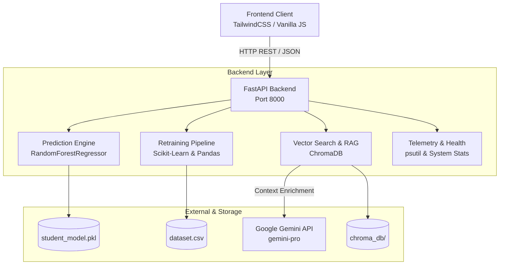

# 🎓 InsightML — Student Performance Prediction & MLOps Platform

**InsightML** is an end-to-end Machine Learning and MLOps web application designed to predict student academic performance, identify at-risk students for early educational interventions, and provide real-time ML model observability, drift monitoring, and continuous retraining capabilities.

---

## 📌 Table of Contents

- [Features & Role-Based Dashboards](#-features--role-based-dashboards)
- [System Architecture](#-system-architecture)
- [Tech Stack](#-tech-stack)
- [Project Directory Structure](#-project-directory-structure)
- [Prerequisites](#-prerequisites)
- [Installation & Setup](#-installation--setup)
- [Running the Application](#-running-the-application)
- [API Reference](#-api-reference)
- [Machine Learning & RAG Details](#-machine-learning--rag-details)
- [Troubleshooting & FAQs](#-troubleshooting--faqs)

---

## 🌟 Features & Role-Based Dashboards

InsightML provides tailored role-based workflows and specialized pages:

### 1. 🎓 Student Portal (`student.html`)
- **Risk Score & Grade Prediction:** Real-time score forecast (0–20 scale) categorized into **LOW**, **MEDIUM**, or **HIGH** risk.
- **Personalized Recommendations:** Actionable guidance to boost study habits, attendance, and subject mastery.
- **Engagement Metrics:** Visual tracking of study hours, participation, and grade targets.

### 2. 👨‍🏫 Instructor / Teacher Portal (`teacher.html`)
- **Class-Wide Risk Triage:** High-level summary of at-risk students needing immediate interventions.
- **Student Filtering & Search:** Rapid assessment of students by GPA, absences, and failure risk.
- **Intervention Flagging:** Workflow to schedule advising sessions and track student progress over time.

### 3. ⚙️ MLOps Admin Console (`admin.html`)
- **Live System Telemetry:** Real-time monitoring of API latency, uptime, throughput (req/min), CPU, and memory utilization.
- **Model Drift Detection:** Visual tracking of 1H, 24H, and 7D data & prediction drift distributions.
- **Deployment Registry:** Active model versions (e.g. `Random Forest v1.3.0`) and health indicators.
- **Automated Alerts:** Threshold-based system notifications for high memory/CPU usage or performance dips.
- **Online Model Retraining:** Trigger one-click model retraining with updated synthetic/production datasets.

### 4. 🔮 Prediction Playground (`prediction.html`)
- Interactive parameter sliders for:
  - Weekly Study Hours (`0: <2h`, `1: 2-5h`, `2: 5-10h`, `3: >10h`)
  - Previous Course Failures (`0` to `4+`)
  - Total Absences (`0` to `93`)
  - Historical GPA (`0.0` to `4.0`)
  - Classroom Participation Score (`0` to `100`)
- Instant evaluation feedback with risk categorization.

### 5. 🤖 AI Advisory Assistant (`assistant.html`)
- **Retrieval-Augmented Generation (RAG):** Integrates **ChromaDB** vector store with **Google Gemini (`gemini-pro`)**.
- Delivers instant, context-aware answers to student and course performance queries.
- Built-in fallback contextual response mechanism when offline or if no API key is provided.

### 6. 📜 History & Audit Log (`history.html`)
- Centralized log of historical predictions, parameter snapshots, and batch evaluation results.

---

## 🏗 System Architecture



---

## 🛠 Tech Stack

### **Frontend**
- **HTML5 & CSS3** (Vanilla with custom gradients, dark mode, and glassmorphism)
- **Tailwind CSS** (via CDN with custom color tokens and animations)
- **JavaScript (ES6+)** (`api.js`, `app.js`, `layout.js`)
- **Google Fonts & Material Symbols**

### **Backend & APIs**
- **Python 3.9+**
- **FastAPI** — High-performance asynchronous REST API framework
- **Uvicorn** — ASGI web server
- **Pydantic** — Request/response data validation
- **psutil** — System hardware telemetry (CPU, RAM, Process stats)

### **Machine Learning & AI**
- **Scikit-Learn** — `RandomForestRegressor` for score and risk predictions
- **Joblib** — Model serialization and deserialization
- **Pandas & NumPy** — Data manipulation and feature matrix operations
- **ChromaDB** — Embedded vector store for student profile embeddings
- **Google Generative AI SDK** (`google-generativeai`) — Gemini Pro LLM integration

---

## 📁 Project Directory Structure

```text
d:/ASE/
├── backend/
│   ├── chroma_db/             # ChromaDB vector database files
│   ├── ml_models/
│   │   ├── dataset.csv        # Student feature and score dataset
│   │   ├── student_model.pkl  # Trained Random Forest model
│   │   └── train.py           # Training and dataset generation script
│   ├── rag/
│   │   └── indexer.py         # ChromaDB indexing script for student profiles
│   ├── main.py                # FastAPI main application & endpoints
│   └── requirements.txt       # Python backend dependencies
├── js/
│   ├── api.js                 # API communication layer (Fetch wrappers)
│   ├── app.js                 # UI interactions, predictions & chart handlers
│   ├── layout.js              # Theme, navigation, and layout utilities
│   └── tailwind-config.js     # Custom Tailwind theme tokens & design system
├── admin.html                 # MLOps Administration & Monitoring dashboard
├── assistant.html             # AI Student Advisory & RAG Chatbot
├── history.html               # Prediction history and evaluation audit logs
├── index.html                 # Landing / Role selector page
├── prediction.html            # Interactive Student Risk Predictor
├── student.html               # Student individual progress portal
├── teacher.html               # Instructor / Class overview portal
├── screenshot.png             # UI preview image
└── README.md                  # Project documentation
```

---

## ⚙️ Prerequisites

- **Python 3.9** or higher installed on your system.
- Modern web browser (Chrome, Edge, Firefox, Brave, Safari).
- *(Optional)* **Google Gemini API Key** for full AI conversational capabilities in the assistant.

---

## 🚀 Installation & Setup

### 1. Clone or Open the Repository
```bash
cd d:/ASE
```

### 2. Set Up a Python Virtual Environment
#### On Windows (PowerShell):
```powershell
python -m venv venv
.\venv\Scripts\Activate.ps1
```

#### On Linux / macOS:
```bash
python3 -m venv venv
source venv/bin/activate
```

### 3. Install Dependencies
```bash
pip install -r backend/requirements.txt
```

### 4. Configure Environment Variables (Optional for Gemini LLM)
Create a `.env` file in the `backend/` directory or project root:
```env
GEMINI_API_KEY=your_google_gemini_api_key_here
```
> **Note:** If `GEMINI_API_KEY` is not provided, the AI Assistant will seamlessly fall back to local context retrieval from ChromaDB.

---

## 🏃 Running the Application

### Step 1: Initialize ML Model & Vector Store *(If not already initialized)*
```bash
# Train the initial Random Forest model and generate dataset.csv
python backend/ml_models/train.py

# Initialize the ChromaDB vector collection with student records
python backend/rag/indexer.py
```

### Step 2: Start the FastAPI Backend Server
```bash
uvicorn backend.main:app --reload --host 127.0.0.1 --port 8000
```
- API will be live at: `http://127.0.0.1:8000`
- Interactive Swagger API docs: `http://127.0.0.1:8000/docs`
- Redoc API docs: `http://127.0.0.1:8000/redoc`

### Step 3: Launch the Frontend
You can open `index.html` directly in your browser or run a simple local web server:

```powershell
# Using Python HTTP server:
python -m http.server 3000
```
Then visit **`http://localhost:3000`** (or open [index.html](file:///d:/ASE/index.html)).

---

## 📡 API Reference

| Method | Endpoint | Description | Request Body / Parameters |
| :--- | :--- | :--- | :--- |
| `POST` | `/api/predict` | Predicts final score & risk level for a student | `study_hours`, `prev_failures`, `absences`, `past_gpa`, `participation` |
| `POST` | `/api/train` | Appends new student record and retrains the model | `study_hours`, `prev_failures`, `absences`, `past_gpa`, `participation`, `score` |
| `POST` | `/api/chat` | RAG-augmented AI chatbot response | `{"message": "string"}` |
| `GET` | `/api/health` | System health, uptime, latency, request throughput | *None* |
| `GET` | `/api/alerts` | Active hardware & model alerts (CPU/RAM thresholds) | *None* |
| `GET` | `/api/deployments` | List of deployed model services and resource usage | *None* |
| `GET` | `/api/drift` | Statistical drift vectors for 1H, 24H, and 7D intervals | *None* |

### Example Prediction Request:
```bash
curl -X POST "http://127.0.0.1:8000/api/predict" \
     -H "Content-Type: application/json" \
     -d '{
       "study_hours": 2,
       "prev_failures": 0,
       "absences": 4,
       "past_gpa": 3.4,
       "participation": 85
     }'
```

### Example Prediction Response:
```json
{
  "predicted_score": 15.2,
  "risk_level": "LOW",
  "model_version": "Random Forest v1.3"
}
```

---

## 📊 Machine Learning & RAG Details

### Features Used by the Model
1. **Study Hours:** Categorical tier (`0: <2h`, `1: 2-5h`, `2: 5-10h`, `3: >10h`)
2. **Previous Failures:** Count of past failed modules (`0` to `4`)
3. **Absences:** Total class sessions missed (`0` to `93`)
4. **Past GPA:** Historical cumulative grade point average (`1.0` to `4.0`)
5. **Participation Score:** Classroom interaction rating (`0` to `100`)

### Target & Risk Categories
- **Target:** Continuous Final Score (`0.0` to `20.0`)
- **Risk Thresholds:**
  - `Score < 10.0`: 🔴 **HIGH RISK** (Immediate intervention recommended)
  - `10.0 <= Score < 14.0`: 🟡 **MEDIUM RISK** (Monitoring recommended)
  - `Score >= 14.0`: 🟢 **LOW RISK** (On track for success)

---

## ❓ Troubleshooting & FAQs

- **CORS Errors:** The FastAPI backend is configured with `CORSMiddleware` with `allow_origins=["*"]`. Ensure backend is running on `http://127.0.0.1:8000`.
- **Model Not Loaded:** Run `python backend/ml_models/train.py` to regenerate `backend/ml_models/student_model.pkl`.
- **ChromaDB Connection Issues:** Run `python backend/rag/indexer.py` to re-index the synthetic student documents.
- **Port Conflicts:** If port `8000` is in use, pass `--port <new_port>` to `uvicorn` and update the base URL in [js/api.js](file:///d:/ASE/js/api.js).

---

## 📄 License
This project is licensed under the MIT License.


